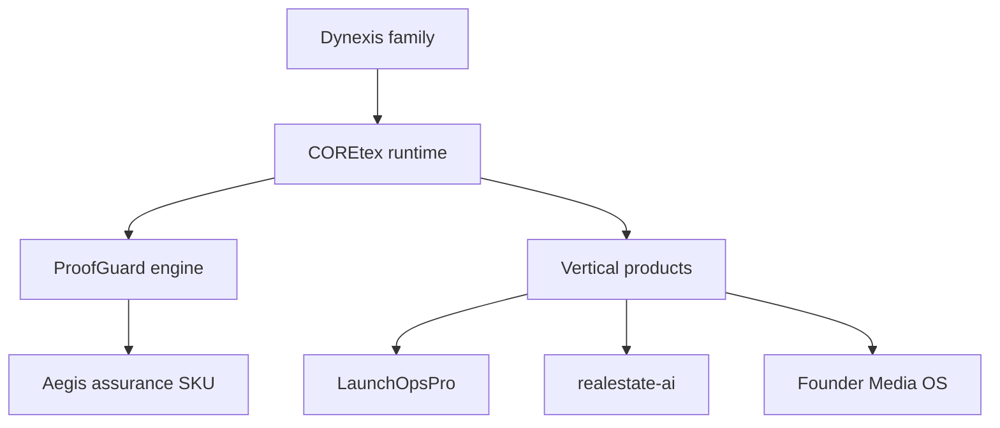

# Canonical portfolio map

Status: accepted portfolio direction. This document defines boundaries; it does not claim that every target integration is complete.

## First-principles structure

The portfolio separates four concerns that were previously blurred across clone-born repositories:

1. **Brand and product family:** Dynexis names the operating-system family.
2. **Shared runtime:** COREtex owns reusable orchestration, policy hooks, identity, and observability contracts.
3. **Governance:** ProofGuard is the technical engine. Aegis is the buyer-facing assurance service and evidence pack powered by that engine.
4. **Vertical products:** LaunchOpsPro, AI Integration Course v2, realestate-ai, and Founder Media OS solve distinct customer problems and consume shared capabilities through explicit contracts.

## Ownership rules

| Concern | Owner | Must not be duplicated in |
|---|---|---|
| Cross-product orchestration contracts | COREtex / gnoscenti-command-center | Product-specific UI repositories |
| Attestation schema, risk decisions, audit evidence | ProofGuard | Aegis marketing or vertical-product code |
| Buyer onboarding, assessment, evidence delivery | Aegis offer documentation | ProofGuard engine internals |
| Founder launch workflow and operator UX | LaunchOpsPro | Founder Autopilot variants |
| Course curriculum, learner progress, tutor UX | ai-integration-course-v2 | Older course repositories |
| Real-estate agent workflows and paid offer | realestate-ai | realtorai and workspace variants |
| Media workflow and publishing pipeline | founder-media-os | local-shorts-engine as a standalone product |

## Integration contract

Shared capabilities must cross repository boundaries through versioned APIs, schemas, packages, or recorded architecture decisions. Copying a dependency manifest is not an integration strategy.

Each consumer must state:

- the contract and version it consumes;
- failure behavior and timeout policy;
- data ownership and retention;
- authentication and authorization boundary;
- local-development substitute or fixture;
- compatibility test that runs in CI.

## Evidence vocabulary

Repositories use four labels consistently:

- **Implemented:** present in code and exercised by an automated check.
- **Demonstrated:** reproducible with a documented command or recorded artifact.
- **Illustrative:** fixture, mock, or design target; not production output.
- **Planned:** accepted direction with no implementation claim.
