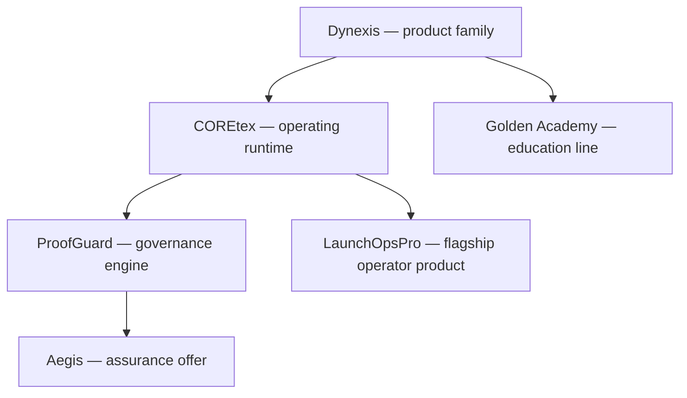

# MicroAI Studios DAO

We build governed AI systems that turn ambitious workflows into inspectable, testable software.

Our engineering standard is simple: secure defaults, human authority over consequential actions, evidence-backed claims, and small changes that can be reviewed and reversed.

## Canonical product architecture

| Layer | Role | Canonical source | Maturity |
|---|---|---|---|
| Dynexis | Product-family architecture | [dynexis-core](https://github.com/Gnoscenti/dynexis-core) | Architecture reference |
| COREtex | Shared operating and orchestration layer | [gnoscenti-command-center](https://github.com/Gnoscenti/gnoscenti-command-center) | Active integration surface |
| ProofGuard | Governance engine and evidence model | [proofguard-ai](https://github.com/Gnoscenti/proofguard-ai) | Active prototype |
| Aegis | Buyer-facing governance-assurance offer powered by ProofGuard | [ProofGuard product definition](https://github.com/Gnoscenti/proofguard-ai/tree/main/docs) | Commercial packaging; not a separate engine |
| LaunchOpsPro | Flagship founder/operator workflow product | [LaunchOpsPro](https://github.com/Gnoscenti/LaunchOpsPro) | Active flagship |
| Golden Academy | Commercial AI education line | [AI Integration Course v2](https://github.com/MicroAIStudios-DAO/ai-integration-course-v2) | Canonical course property |

## Active product repositories

| Product | Outcome | Evidence to inspect |
|---|---|---|
| [LaunchOpsPro](https://github.com/Gnoscenti/LaunchOpsPro) | Governed launch and operating workflows for founders and lean teams | Architecture, tests, CI, release-readiness notes |
| [ProofGuard AI](https://github.com/Gnoscenti/proofguard-ai) | Policy, attestation, human-review, and audit concepts for agentic systems | Threat model, control matrix, fixtures, tests |
| [AI Integration Course v2](https://github.com/MicroAIStudios-DAO/ai-integration-course-v2) | Guided, practical AI education | Product flow, curriculum, deployment signals |
| [realestate-ai](https://github.com/Gnoscenti/realestate-ai) | Canonical real-estate AI product | Tests, CI, paid-offer implementation |
| [founder-media-os](https://github.com/Gnoscenti/founder-media-os) | Multi-agent media production workflow | Deployable pipeline and test evidence |
| [EPI Governance](https://github.com/Gnoscenti/EPI-governance) | Ethical Profitability Index governance research and implementation | Standards, tests, CI, Docker |

## How we work

- Every active repository should explain the problem, architecture, setup, test path, security model, and current limitations.
- CI must reproduce the checks named in the README.
- Examples and screenshots are labeled as live, recorded, synthetic, or illustrative.
- Compliance mappings are engineering aids, not certifications or legal advice.
- Secrets never belong in Git; consequential automation fails closed by default.
- Consolidation preserves history and unique work before any repository is archived.

Read the [portfolio map](https://github.com/MicroAIStudios-DAO/.github/blob/main/docs/PORTFOLIO.md) for product boundaries and the [consolidation record](https://github.com/MicroAIStudios-DAO/.github/blob/main/docs/CONSOLIDATION.md) for canonical-repository decisions.

## Collaboration

Start with the repository README and contribution guide. For security concerns, follow the private reporting process in [`SECURITY.md`](https://github.com/MicroAIStudios-DAO/.github/blob/main/SECURITY.md); do not open a public issue containing vulnerability details.
